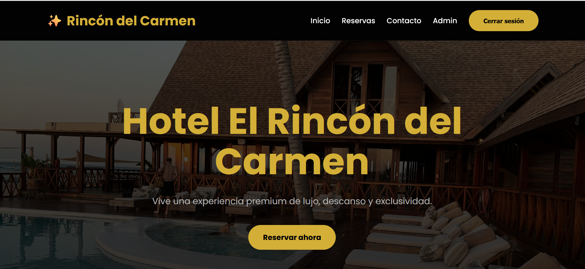
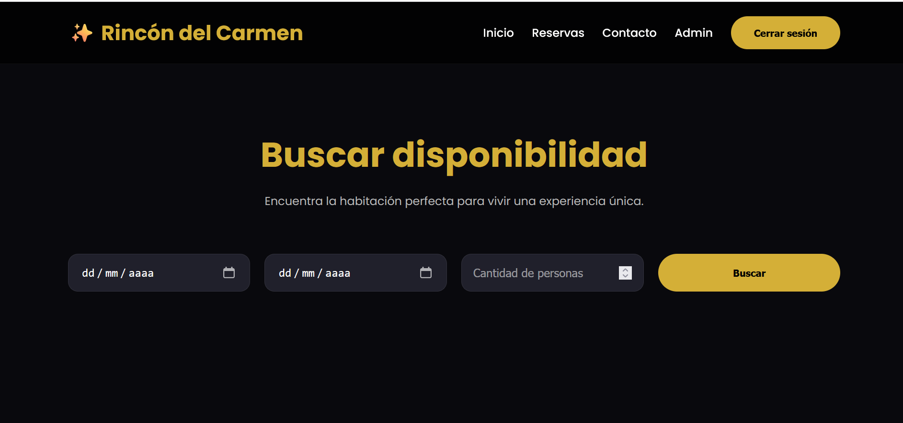
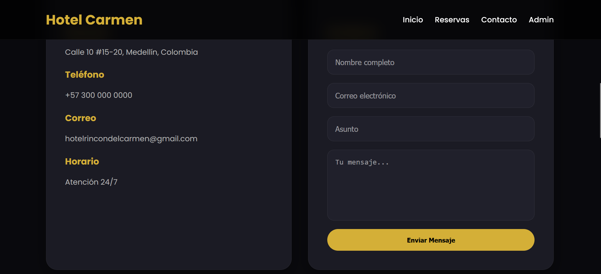
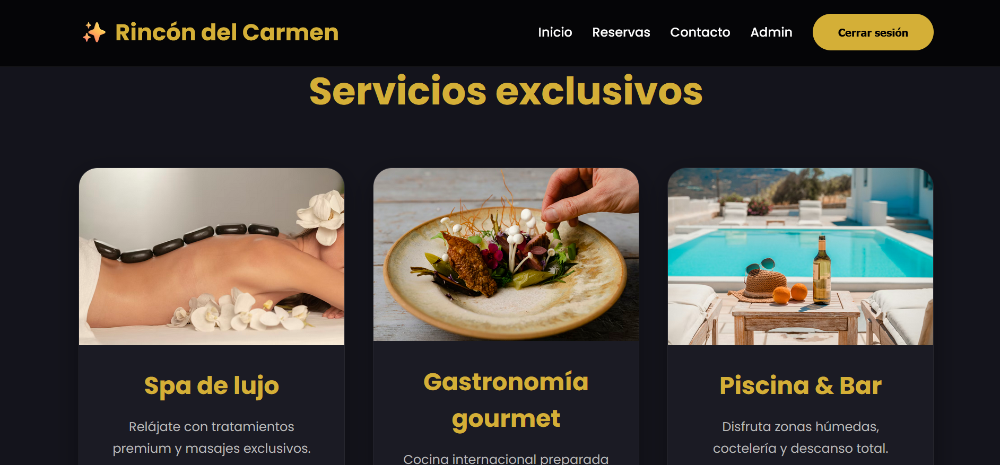

 Hotel El Rincón del Carmen
Descripción del proyecto

Hotel El Rincón del Carmen es una aplicación web moderna desarrollada como simulación de un sistema Full Stack Junior. Su objetivo es ofrecer una plataforma digital para la gestión de reservas de habitaciones, autenticación de usuarios y administración interna del hotel.

El sistema permite a los usuarios consultar disponibilidad, realizar reservas y gestionarlas en tiempo real, mientras que un panel administrativo permite controlar habitaciones y reservas.

El proyecto fue construido aplicando buenas prácticas de desarrollo frontend, arquitectura modular y almacenamiento local con LocalStorage, simulando el comportamiento de una API real.

 Objetivo

Desarrollar un sistema web funcional, escalable y responsivo que permita:

Presentar el hotel de forma digital y atractiva
Gestionar reservas de habitaciones
Administrar usuarios y disponibilidad
Simular un entorno real de sistema hotelero

Tecnologías utilizadas
Frontend
HTML5
CSS3
JavaScript ES6+
Arquitectura
JavaScript Modular
Web Components
Persistencia
LocalStorage (simulación de backend)
UI/UX
Diseño Responsive (Mobile First)
Flexbox & CSS Grid
Estilo Luxury 

Características principales

Landing Page
Hero section moderno y visualmente atractivo
Habitaciones destacadas
Servicios del hotel
Diseño responsive y elegante
Footer informativo

Sistema de reservas
Búsqueda de disponibilidad por fechas
Selección de huéspedes
Visualización de habitaciones disponibles
Cálculo automático del total
Validación de solapamiento de reservas
Cancelación de reservas

Autenticación
Registro de usuarios
Inicio de sesión
Persistencia de sesión
Protección de rutas

Panel administrativo
Gestión de habitaciones (crear, editar, eliminar)
Gestión de reservas
Visualización de usuarios
Control de disponibilidad

## 📱 Vista Previa del Diseño

| landing page | reservas |
| :---: | :---: |
|  |  |

| contacto | servicios |
| :---: | :---: |
|  |  |

Lógica del sistema

revención de solapamientos

El sistema evita reservas duplicadas mediante:

checkIn < reservation.checkOut &&
checkOut > reservation.checkIn

Cálculo de estadía
Cálculo automático de noches
Total dinámico según precio por noche

Persistencia

Todos los datos se almacenan en:

localStorage

Incluyendo:

Usuarios
Reservas
Habitaciones
Sesión activa

Estructura del proyecto
hotel-rincon-carmen/
│
├── index.html
├── reservas.html
├── contacto.html
├── login.html
├── register.html
├── admin.html
│
├── README.md
│
├── assets/
│   ├── css/
│   │   └── global.css
│   │
│   ├── js/
│   │   ├── app.js
│   │   ├── admin.js
│   │   ├── auth.js
│   │   ├── guards.js
│   │   ├── login.js
│   │   ├── register.js
│   │   ├── reservations.js
│   │   ├── seed.js
│   │   ├── storage.js
│   │   └── utils.js
│   │
│   ├── components/
│   │   ├── navbar.js
│   │   └── footer.js
│   │
│   └── images/
│

Módulos principales

storage.js
Manejo de LocalStorage
Persistencia de datos

reservations.js
Lógica de reservas
Validación de disponibilidad
Renderizado dinámico

auth.js
Registro e inicio de sesión
Gestión de usuarios

guards.js
Protección de rutas
Control de acceso

seed.js
Datos iniciales del sistema
Usuario administrador

utils.js
Funciones auxiliares
Formato de moneda
Cálculo de noches
Generación de IDs

Diseño 

El diseño está basado en una estética Luxury Hotel:

🎨 Paleta oscura premium
✨ Detalles dorados elegantes
🧊 Glassmorphism sutil
🃏 Cards modernas
🎬 Animaciones suaves
📱 Diseño totalmente responsive
📱 Responsive Design

Compatible con:

📱 Móviles
📟 Tablets
💻 Escritorio

Seguridad implementada
Validación de formularios
Control de acceso por roles
Protección de rutas privadas
Validación de fechas
Verificación de sesión activa

Usuarios del sistema

Administrador
Correo: admin@hotel.com
Contraseña: admin123

Proyecto desarrollado como práctica académica simulando un sistema Full Stack Junior, aplicando:

HTML5
CSS3
JavaScript ES6+
Arquitectura modular
Web Components
LocalStorage